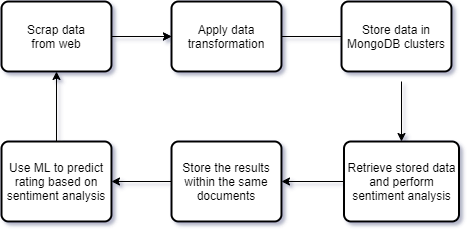

# NoSQL Sentiment Analysis
Hi there!

## Introduction

In this project I will build a NoSQL database that stores reviews of restaurants scraped from the web.
This an (almost) end to end Data Science project, where I begin with the design of the project, the database design,
going to the data collection, cleaning and transforming and ending with a Machine Learning classifier that tries to predict
que overall rating of a restaurant based on the sentiment analysis of its reviews. In the figure bellow you can see the overview of the
project workflow.

## The data

This is a public dataset that will be collected from the [Tripadvisor](https://www.tripadvisor.com.br/)
website, whose has tons of information about restaurants, trips, places to stay and more.
The data will be scraped using the Python programming language and Selenium library.

During this process the data is stored in a [MongoDB](https://www.mongodb.com/) database, using their free cloud service, Atlas.
When designing a NoSQL database, the first (and only) thing to have in mind is its performance. A MongoDB
database must be design considering the types of queries that will be made in the future. Therefore,
in order to create a most effective database as possible, we need to study what kind of queries we will perform later on.
Among many schemas design for a Document-based database, there is five basics types of relationships,
like *One to One, One to Few, One to Many, One to Squillions and Many to Many*.

As best practices for MongoDB users, each of those relationships has an appropriate way of using:

<ol>
<li> One to One: Use Key-Value paris </li>
<li> One to Few: Prefer Embedding </li>
<li> One to Many: Prefer Referencing </li>
<li> One to Squillions: Inverse Referencing </li>
<li> Many to Many: Multiple Referencing</li>
</ol>

Therefore, we have to decide how are we going to query this data in the future. In this dataset we do not
have too much information about the restaurant, besides the restaurant name, the rating and number of ratings.
The most important field to query is the review title and the review text, and later on the sentiments of the review.

The easiest to store this data is the form of Schema 1, where all the data is within only one document. One document
holds the restaurant information and only one review. Therefore, there will be one document for each review given to each restaurant.

Schema I - One to One:

    {
        "_id": ObjectID(),
        "Restaurant Name": restName,
        "Rating": rating,
        "Number of Ratings": numberRatings,
        "Review Title": title,
        "Review Date": date,
        "Reviewer Name": reviewer,
        "Review": rev,
        "Sentiments": sentimentResult
    }

As there will be thousands of restaurants and each restaurant have hundreds of reviews, this schema will
lead us in a collection with from a hundred thousands to millions of documents.
We also will be able to query for each restaurant isolated, reviewer and sentiments.

The second Schema uses arrays to store the reviews. In this schema, each document will represent one
restaurant and all the reviews of each restaurant will be stored in an array of documents.

Schema II - One to Few:

    {
        "_id": ObjectID(),
        "Restaurant Name": restName,
        "Number of Reviews": numberRatings
        "Reviews": [{
            "Review Title": title,
            "Review Date": date,
            "Reviewer Name": reviewer,
            "Review": rev,
            "Sentiments": sentimentResult
                    }, ...]
    }

This schema leads to a considerably small number of documents, as there will many documents as there are
many restaurants. However, this is an embedded schema, and as we saw before, embedding is recommended
only to One to Few schemas. As the time passes, there will be more and more reviews for the restaurants, and
at some point in time it will be no more a One to Few but a One to Many.

This leads us to choose a schema appropriated to the One to Many relationship.

Schema III - One to Many:

Restaurant documents:

    {
        "_id": ObjectID(),
        "restaurant_name": restname,
        "rating": rating,
        "number_of_reviews": numberofratings
    }

Review documents:

    {
        "_id": ObjectID(),
        "restaurant_id": restaurant_ID,
        "review_title": title,
        "review_date": date,
        "reviewer_name": reviewer,
        "review": rev,
        "sentiments": [sentiment result]
    }

For this particular problem, schema 3 is (probably) the best option, as it is easy to query as a One to One relationship
and does not suffer from duplicated records of the restaurant data. Besides, it corrects the problem of the schema 2
by not having to large arrays sizes. However, as the size of this dataset will be only a small smaple of the whole restaurants in Brazil, I will keep simple and choose the Schema I for simplicity.

Please refer to the [multiple_restaurants_scraper.py](https://github.com/micheldearaujo/NoSQLSentimentAnalysis/blob/main/multiple_restaurants_scraper.py) to view the code in depth.

Later after gathering 30745 reviews of 40 restaurants I realized that I forget a important information, the reviews score. So I went back and scraped the missing data and completed the schema, as you can see bellow.

    {
        "_id": ObjectID(),
        "restaurant_name": restName,
        "rating": rating,
        "number_of_ratings": numberRatings,
        "review)title": title,
        "review_date": date,
        "reviewer_name": reviewer,
        "review": rev,
        "reviews_scores": {
            "Excellent": int(),
            "Very Good": int(),
            "Good": int(),
            "Bad": int(),
            "Terrible": int()
        }
        "sentiments": sentimentResult
    }

This amount of information can provides us with some insights about the food market in Brazil.

## Querying data for analysis

